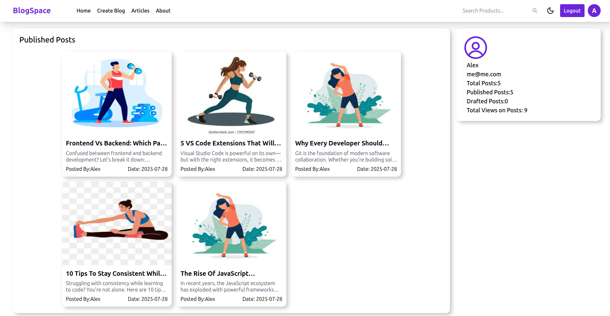
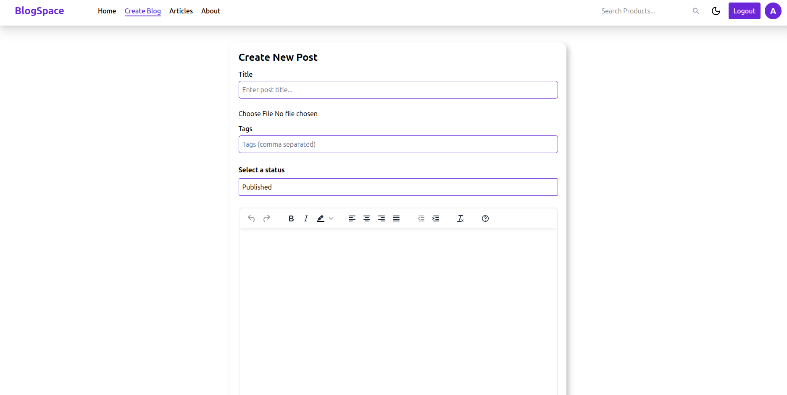

# 📝 Blog App

A full-featured, full-stack **React blog platform** with draft/publish support, live view counts, user profiles, likes system, TinyMCE integration, Redux state management, and dark mode support.

> 🚀 **Live Demo:** [https://appwriteblogspace.netlify.app/](https://appwriteblogspace.netlify.app/)

---
## 📸 Screenshots




---

## 🌟 Features

- 🔐 **User Authentication** with Appwrite
- ✍️ **Create / Edit Posts** using a rich **TinyMCE** editor
- 🗂️ **Drafts & Published Posts**
- ❤️ **Like System** with per-user like tracking and toggle behavior
- 📈 **Live View Count** per post
- 🔍 **Search with live suggestions and debounce**
- 🔃 **Pagination**
- 🌗 **Dark / Light Theme** toggle with localStorage persistence
- 👤 **User Profiles** with post stats (published, drafts, total views, liked posts)
- 📱 **Responsive UI** with mobile support
- ⚡ Built with **Redux**, **Tailwind**, and **Vite**

---

## 📦 Tech Stack

| Tech                | Role                            |
| ------------------- | ------------------------------- |
| **React**           | Frontend framework              |
| **Redux Toolkit**   | Global state management         |
| **Tailwind CSS**    | Utility-first styling & theming |
| **TinyMCE**         | Rich-text content editor        |
| **Appwrite**        | Auth, Database, File storage    |
| **Vite**            | Dev server & bundler            |
| **React Hook Form** | Form handling and validation    |

---

## ❤️ Like Feature Overview

- Users can like or unlike a post
- A **user document** tracks liked post IDs (`likedPost: string[]`)
- Like icons (`FaRegHeart`, `FaHeart`) update based on the current user's state
- Post `likes` count is stored in the article document
- Like button is responsive and visually updates in real-time using Redux

---

## ⚙️ Getting Started

### 1. Clone the repository

```bash
git clone https://github.com/your-username/blog-app.git
cd blog-app
npm install

create a file named .env.local
and  fill in your own credentials
VITE_APPWRITE_PROJECT_ID=your-appwrite-project-id
VITE_APPWRITE_ENDPOINT=https://cloud.appwrite.io/v1
VITE_DATABASE_ID=your-database-id
VITE_ARTICLE_COLLECTION_ID=your-posts-collection-id
VITE_USERS_COLLECTION_ID="your-user-collection-id"
VITE_BUCKET_ID=your-bucket-id
VITE_TINYMCE_API_KEY=your-tinymce-api-key
